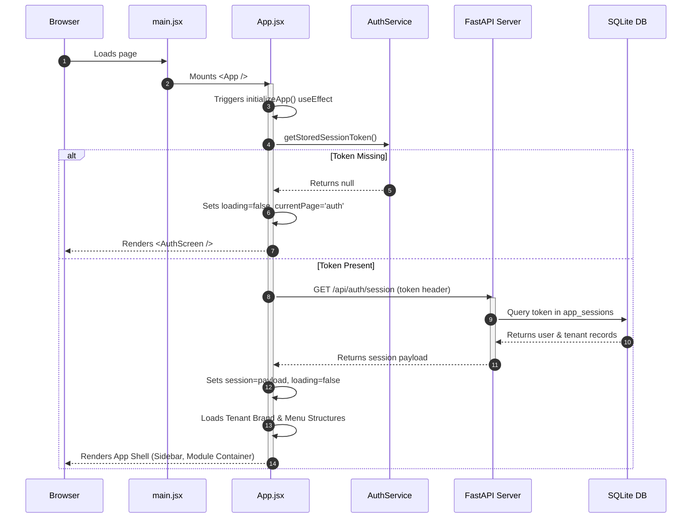
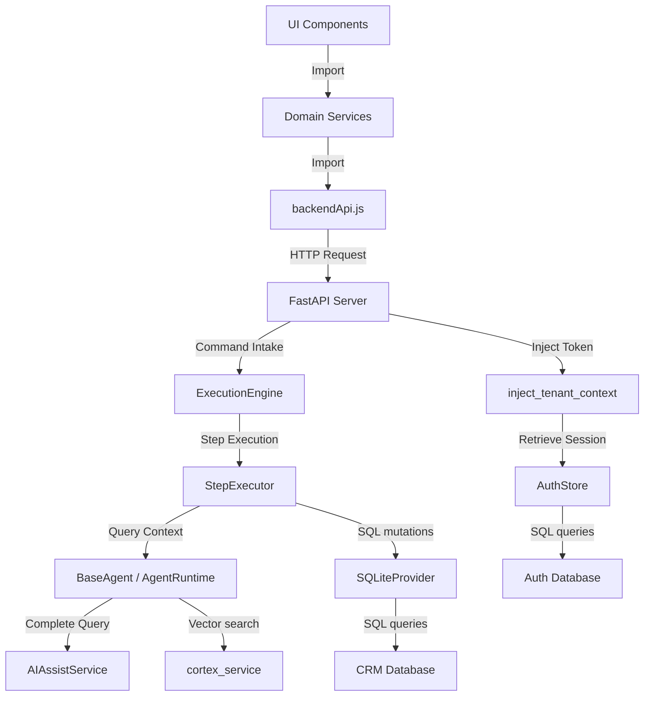
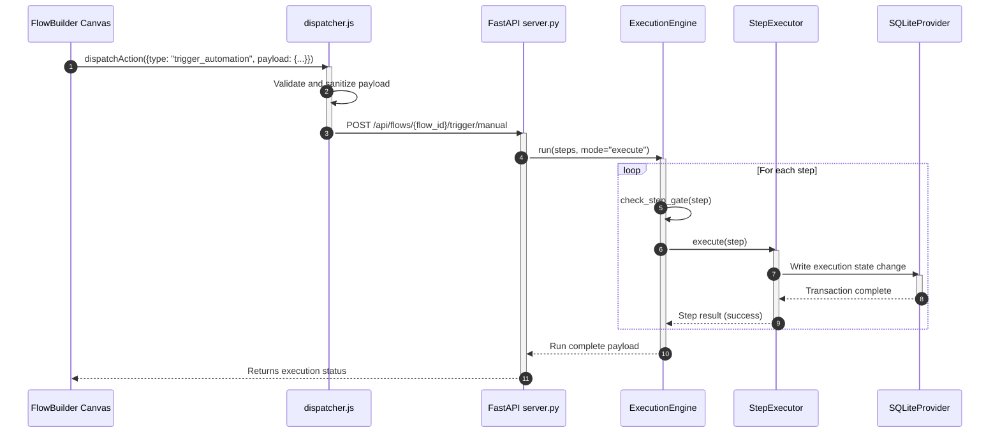

# AIO CRM — Complete Architectural & Engineering Report

This report serves as a comprehensive, offline-ready architectural specification of the AIO CRM codebase. It is designed to enable future coding agents and senior architects to understand and interface with the system without requiring direct access to the repository.

---

## 1 Executive Summary

- **Overall Purpose**: AIO CRM is a unified, multi-tenant, voice-activated customer relationship management (CRM) and artificial intelligence (AI) orchestration platform. It integrates communications (IMAP/SMTP, SMS, VoIP calling), automated workflow builders, document/vector vaults (Cortex), and a collaborative team of specialized AI agents.
- **Current Maturity**: Phase 1 & 2 stable (verified as of March 2026). It contains hardened execution zones, strict session boundaries, and structured multi-agent coordination.
- **Primary Technologies**: 
  - **Backend**: Python 3.13 + FastAPI + SQLite3 + Vosk (offline speech-to-text) + ElevenLabs (text-to-speech).
  - **Frontend**: React 19.2.0 + Vite 7.2.4 + Tailwind CSS 4.1.18 + @xyflow/react 12.0.0 (ReactFlow) + @excalidraw/excalidraw 0.18.0 + Remotion 4.0.441.
- **Architectural Style**: Layered Client-Server. The frontend utilizes a strict service-oriented domain model (domain services encapsulate backend calls). The backend acts as a modular REST API and state repository, running a polling background worker loop for workflow scheduling.
- **Estimated Project Size**: Large. The project contains ~300 source files. Core files like `backend/server.py` (~10.2k lines) and `backend/data_provider.py` (~10.1k lines) contain massive, comprehensive system logic.

---

## 2 Directory Tree

```
AIOCRM/
├── Protocols/                  # 🛡️ LIVE SYSTEM GOVERNANCE (canonical)
│   ├── charlie-alpha-protocol.md # Flow command envelope law
│   ├── lockdown.md            # Hard no-touch security guidelines
│   └── tagging.md             # Tag classification prefix contract
├── docs/                      # Reference specifications and audits
│   ├── SYSTEM INVARIANTS CONTRACT.md # Session/identity isolation rules
│   ├── AI_PROVIDER_SYSTEM_SOURCE_OF_TRUTH.md # AI provider guidelines
│   ├── service-contract-map.md  # Service layer validation contract
│   └── Charlie VTT Commands.md # Voice-to-Text command dictionary
├── frontend/                  # React 19 frontend workspace
│   ├── public/                # Static public assets
│   ├── src/
│   │   ├── api/               # API connection client
│   │   ├── app/               # Main layout structures
│   │   ├── assets/            # Local asset files
│   │   ├── components/        # Shared components and UI elements
│   │   │   ├── CMS/           # Content hub components
│   │   │   ├── Modals/        # Modular confirm/action popups
│   │   │   └── ui/            # Basic design primitives (buttons, inputs)
│   │   ├── contexts/          # React 19 context providers (Auth, Signal, VTT)
│   │   ├── data/              # Default databases and structures
│   │   ├── hooks/             # Utility React hooks
│   │   ├── lib/               # Custom wrappers (Theme, supabase stubs)
│   │   ├── modules/           # 20+ functional features (CRM, Flows, Brain)
│   │   ├── orchestration/     # Client actions and Dispatcher middleware
│   │   ├── pages/             # Basic layouts (Terms, Privacy)
│   │   ├── services/          # Domain services (AI, CRM, Flows, Comms)
│   │   ├── templates/         # Render layouts
│   │   └── utils/             # Front-end string/formatting helpers
│   ├── package.json           # Frontend dependency manifest
│   ├── vite.config.js         # Build and routing definitions
│   └── tailwind.config.js     # Tailwind setup
├── backend/                   # FastAPI backend workspace
│   ├── data/                  # SQLite databases and assets
│   │   ├── aio_crm.db         # CRM and workflow data store
│   │   ├── aio_auth.db        # Core auth/membership database
│   │   ├── audio/             # Rendered speech recordings
│   │   └── video/             # Rendered videos
│   ├── blueprints/            # Pre-configured workspace templates
│   ├── schemas/               # JSON-schema definitions for flow/tenant specs
│   ├── server.py              # Main FastAPI entry point (10,205 lines)
│   ├── orchestration.py       # Workflow execution engine (5,499 lines)
│   ├── data_provider.py       # SQLite data store adapters (10,107 lines)
│   ├── auth_store.py          # Membership and configurations (5,108 lines)
│   ├── agent_definitions.py   # Agent roles, prompts, and permissions
│   ├── agent_runtime.py       # AI multi-agent execution loop
│   ├── ai_routing.py          # Model routing tables
│   ├── ai_service.py          # LLM completion adapter endpoints
│   ├── comms_service.py       # SMTP/IMAP, SMS, and call routines
│   └── requirements.txt       # Python dependency manifest
├── runtime/                   # Local execution storage (logs/caches)
└── scripts/                   # Workspace management and bootstrap helpers
```

---

## 3 Technology Stack

### Frontend
- **Runtime**: React 19.2.0, React Router DOM 7.13.0
- **Build Tools**: Vite 7.2.4, PostCSS 8.5.6, ESLint 9.39.1
- **UI & Styling**: Tailwind CSS 4.1.18, Lucide React 0.562.0
- **Flow Engine**: @xyflow/react 12.0.0 (ReactFlow)
- **Rich Elements**: @excalidraw/excalidraw 0.18.0, React Quill 2.0.0, @tinymce/tinymce-react 6.3.0
- **Media Engine**: Remotion 4.0.441, @remotion/cli 4.0.441
- **Utilities**: date-fns 4.1.0, JSZip 3.10.1

### Backend
- **Runtime & Framework**: Python 3.13, FastAPI 0.110.1, Uvicorn 0.25.0
- **Database & Storage**: SQLite3 (via native python driver), Python-dotenv
- **Media/Speech Engine**: Vosk 0.3.45 (offline STT model), ElevenLabs API, FFmpeg/FFprobe
- **Parser**: Python-multipart

### integrations
- **AI Providers**: Ollama (local networks), OpenAI (GPT models), OpenRouter (aggregator), Anthropic (Claude), Google AI (Gemini), Perplexity.
- **Communications**: Telnyx, Twilio, Plivo (SMS/Calls); SMTP/IMAP mail servers.
- **Availability & Meetings**: Google Calendar OAuth, Outlook Calendar OAuth, Zoom API, Google Meet OAuth.

---

## 4 Application Architecture

The system utilizes a structured execution boundary between the front-end interface and a command-orchestrated back-end:

```
┌───────────────────────────────────────────────────────────────┐
│                           FRONTEND                            │
│ ┌───────────────┐   ┌─────────────────┐   ┌─────────────────┐ │
│ │  UI Modules   │ ─►│ Domain Services │ ─►│   backendApi    │ │
│ └───────────────┘   └─────────────────┘   └─────────────────┘ │
└──────────────────────────────┬────────────────────────────────┘
                               │ HTTP Request (camelCase enforced)
                               ▼
┌───────────────────────────────────────────────────────────────┐
│                           BACKEND                             │
│                    ┌───────────────────┐                      │
│                    │   FastAPI Route   │                      │
│                    └─────────┬─────────┘                      │
│                              │                                │
│                              ▼                                │
│                     ┌─────────────────┐                       │
│                     │  AuthStore      │ (Switches Tenant)      │
│                     └────────┬────────┘                       │
│                              │                                │
│                              ▼                                │
│                  ┌───────────────────────┐                    │
│                  │  ExecutionEngine      │                    │
│                  │  ├─ StepExecutor      │                    │
│                  │  └─ AgentRegistry     │                    │
│                  └───────────┬───────────┘                    │
│                              │                                │
│                              ▼                                │
│                     ┌─────────────────┐                       │
│                     │ SQLiteProvider  │ (aio_crm.db)          │
│                     └─────────────────┘                       │
└───────────────────────────────────────────────────────────────┘
```

### Overall Data & Request Flow
1. **Client Action**: A user triggers an action in a UI module (e.g. `frontend/src/modules/Flows`).
2. **Domain Service Check**: The UI invokes a domain service (`FlowsService`) situated in `frontend/src/services/`. Direct UI imports to the raw API client (`backendApi.js`) are forbidden.
3. **API Dispatch**: `backendApi.js` executes an HTTP request to the FastAPI server. Payloads are checked by a camelCase validation middleware.
4. **Tenant Scoping**: The FastAPI HTTP middleware `inject_tenant_context` extracts the token, queries `AuthStore` (stored in `aio_auth.db`), and updates a thread-safe global workspace variable `set_request_tenant_id(tenant_id)`.
5. **Execution**: The router resolves the request. For automated actions, FastAPI delegates execution to the `ExecutionEngine` which uses a topological sort to coordinate actions through `StepExecutor`.
6. **Persistence**: Transactions are recorded in `aio_crm.db` using `SQLiteProvider`.

---

## 5 ReactFlow Analysis

The ReactFlow workflow builder is implemented in `frontend/src/modules/Flows/FlowBuilder.jsx`.

### Core Configurations
- **Custom Nodes**: Declared in `const nodeTypes` as:
  - `trigger`: mapped to `CustomNode.jsx`
  - `action`: mapped to `CustomNode.jsx`
  - `logic`: mapped to `CustomNode.jsx`
  - `webhook`: mapped to `CustomNode.jsx`
  - `socket`: mapped to `CustomNode.jsx`
  - `frame`: mapped to `FrameNode.jsx` (uses `NodeResizer`)
  - `note`: mapped to `NoteNode.jsx` (uses `NodeResizer`)
- **Handles**: `CustomNode` places a `target` handle at `Position.Left` and a `source` handle at `Position.Right` to enforce left-to-right progression.
- **Node Data & Serialization**: The flow graph is structured as a JSON spec complying with the schema defined in `flowSpec.schema.json`. Each node data payload includes:
  - `id`: ULID or step key
  - `label` & `description`
  - `assignedAgent` (e.g. `DELTA`, `ECHO`, `HAMMER`)
  - `config`: node configuration dictionary (`actionType`, `logicType`, `inputs`, `outputs`)
  - `providerKey` & `providerStatus` (for external socket endpoints)

### Workflow Storage & Execution
- **Storage**: Flows are saved via `PUT /api/flows/{flow_id}` into the `flows` table of the database.
- **Execution**: 
  - **Topological Sorting**: On execution, `order_flow_nodes` in `backend/server.py` evaluates the nodes and edges, generating a topological sequence.
  - **Graph Translation**: `build_flow_execution_steps` filters out triggers/frames/notes and maps actionable nodes to execution steps (specifying `assignedAgent`, `intent`, and parameters).
  - **Execution Engine**: The `ExecutionEngine` evaluates the sequence. If a node evaluates as `INPUT_REQUIRED`, execution pauses, changes status to `blocked`, and waits until a form submission resumes it via `engine.run(..., mode="resume")`.

---

## 6 Database

The application uses **SQLite3** split across two primary files in `backend/data/`: `aio_auth.db` (authentication, settings, workspace configurations) and `aio_crm.db` (crm data, workflows, call logs, mail).

### Core Tables

#### `aio_auth.db` (Managed by `auth_store.py`)
- `tenants`: id, name, slug, domain, archivedAt, createdAt, updatedAt, tenantSettings (JSON settings).
- `app_users`: id, email, username, displayName, authProvider, role, avatarUrl, lastLoginAt, createdAt, updatedAt.
- `app_sessions`: id, userId, token, provider, currentTenantId, userAgent, lastSeenAt, expiresAt, createdAt.
- `memberships`: id, userId, tenantId, role, createdAt, updatedAt.
- `role_definitions`: id, tenantId, name, description, capabilitiesJson, isSystem, createdAt, updatedAt.
- `role_assignments`: id, tenantId, roleId, principalType, principalId, createdAt.
- `ai_provider_configs`: id, tenantId, providerKey, label, baseUrl, apiKey, model, temperature, systemGuardrails, taskGuardrails, isDefault, enabled, createdAt, updatedAt.
- `ai_routing_configs`: id, tenantId, intent, providerConfigId, fallbackProviderConfigId, rulesJson, isActive, createdAt.

#### `aio_crm.db` (Managed by `data_provider.py`)
- `contacts`: id, contactId (external), organizationId, tenantId, firstName, lastName, email, phone, company, companyId, title, department, owner, source, status, leadScore, quality, engagement, tagsJson, lastContactedAt, pipelineStage, createdAt, updatedAt, deletedAt.
- `companies`: id, name, industry, size, website, owner, brandProfile, tenantId.
- `tags`: id, name, prefix, label, description, type, isLocked, tenantId.
- `flows`: id, tenantId, name, status, nodesJson, edgesJson, specJson, responsesCount, lastTriggeredAt, createdBy, lastEditedBy, createdAt, updatedAt.
- `flow_drafts`: id, tenantId, name, specJson, createdBy, createdAt, updatedAt.
- `form_submissions`: id, tenantId, formId, contactId, submissionJson, createdContact, submittedAt.
- `contact_activities`: id, tenantId, contactId, userId, activityType, title, description, metadataJson, createdAt, updatedAt.
- `aiEngineRuns`: id, tenantId, command, mode, status, stepsJson, artifactsJson, pendingApprovalsJson, routingJson, traceJson, actorJson, contextJson, pauseReason, resumeAt, lockedUntil, lastError, nextNodeId, currentNodeId, createdAt, updatedAt.

### Migrations & Indexes
- SQLite databases are migrated dynamically during connection setup. `data_provider.py` contains `_ensure_column` and `_rename_column` helpers that check tables and execute `ALTER TABLE ADD COLUMN` schemas at startup.
- Indices are automatically created for foreign key constraints, including indexes on `contacts(tenantId)`, `threads(tenantId)`, and `messages(threadId)`.

---

## 7 Authentication

### Login and Sessions
- **Authentication Routes**: Core credentials verified via `POST /api/auth/login`. OAuth integrations handled by `GET /api/auth/google/authorize` and subsequent callbacks.
- **Session Persistence**: Sessions are saved inside the `app_sessions` table. The token is generated as a secure random URL-safe string: `secrets.token_urlsafe(32)`.
- **Expiry**: Sessions default to a 14-day duration (`expiresAt = (now + 14 days)`). Every query updates `lastSeenAt`.

### Capability-Based Permissions
Capabilities are mapped dynamically through workspace memberships. Core capabilities include:
- `comms.view` & `comms.operate`
- `system.view` & `system.manage`
- `client.access` (triggers client mode, disabling full agent builder controls)

Middleware enforces permission boundaries:
```python
def require_capability(request: Request, capability_id: str):
    session = require_session(request)
    capabilities = request.state.capabilities
    if capability_id not in capabilities:
        raise HTTPException(status_code=403, detail="Unauthorized")
```

---

## 8 AI Architecture

### Unified Prompt Construction (`BaseAgent._build_prompt_contract`)
Prompts are structured as nested JSON containers injected at the system prompt boundary:
1. **System Prompt**: Built from the agent's defined system role description, allowed/disallowed actions, execution policy, and custom system guardrails.
2. **Context**: Combines memory retrieval arrays, active flow context, completed step history outputs, and active email/comms threads.
3. **Task Guidelines**: Standardizes the target intent, selected tool identifiers, and raw operator commands.

### Boardroom/VTT Mode Constraints
If VTT operations mode is active, the system enforces a strict sentence limitation (1–3 sentences max) and forces classification into these states:
- `COMMAND` (immediate confirmation/staging)
- `ASSIST` (concise answering)
- `CONFIRMATION` (single-sentence confirmations)
- `RESULT` (one-sentence completion notices)
- `CLARIFICATION` (a single question)

### Multi-Agent Registry
Defined in `backend/agent_definitions.py`:
- `ALPHA` (AGT-CMD-001): Commander-in-Chief. Handles routing and final approval gates.
- `BRAVO` (AGT-STR-002): Business Analyst. Specializes in strategy and SWOT generation.
- `CHARLIE` (AGT-SUP-003): Core voice and conversational system surface.
- `DELTA` (AGT-CRD-004): Coordinator. Sequences tasks and schedules meetings.
- `ECHO` (AGT-COM-005): Comms specialist. Drafts emails and campaigns.
- `HAMMER` (AGT-CPY-006): Copywriter. Article writing and content development.
- `GHOST` (AGT-ENG-007): Systems Engineer. System health, code reviews, and diagnostics.
- `ARCHER` (AGT-ANL-008): Financial Analyst. ROI calculations and metric tracking.
- `ATLAS` (AGT-LOG-009): Systems Mapper. Coordinates system dependencies.
- `VECTOR` (AGT-DES-013): Graphics designer. Interface/image generation.

---

## 9 Workflow Engine

### Execution Loop (`ExecutionEngine.run`)
1. **Intake**: Takes steps, command, and context.
2. **Topological Ordering**: Iterates over steps sorted by execution order.
3. **Approval Gating**: Evaluates steps through `check_step_gate`. If a step requires approval, execution halts, the run updates to `blocked`, and the system logs `awaiting_approval`.
4. **Execution**: Step parameters are routed to `StepExecutor.execute`.
5. **Self-Healing Loop**: If a step returns an error, `RecoveryEngine.attempt_recovery` classifies the error (e.g., connectivity, rate limits, schema mismatches) and attempts a correction (e.g. route substitution, payload cleaning) before retrying.
6. **State Persistence**: After every step, `persist_runtime_state` writes changes to `aiEngineRuns`.

### Background Worker (`run_resume_worker`)
- A separate background loop runs in `backend/orchestration.py`.
- It executes `resume_due_ai_runs` every 5 seconds, claiming runs with status `paused` where `resumeAt` is less than or equal to the current time, locking the run in the database for 60 seconds to avoid multi-instance execution conflicts.

---

## 10 Forms

Forms are dynamic UI builders defined in `frontend/src/modules/Forms/index.jsx`.

### Structure and Storage
- **Schema**: Forms are defined by a JSON schema representing inputs (text, select, checkbox, email, purchase).
- **Persistance**: Stored in the `forms` table.
- **Submissions**: Saved in `form_submissions`. If the form settings contain `createContact` or `updateContact`, the submit routine extracts identifying fields and inserts/updates the `contacts` table.
- **Purchase Trigger**: If the form schema includes a `purchase` type, submissions write directly to the `orders` table to track transacted payment items.
- **AI Integration**: Submitting a form can submit a `flowRunId`, which wakes the `ExecutionEngine` to resume an active AI workflow stalled on input.

---

## 11 CRM

The CRM modules manage core business data:
- **Contacts**: Contains scoring parameters (`leadScore`), engagement levels (`medium`, `high`), and categorization stages (`New`, `Contacted`, `Qualified`).
- **Companies**: Connects organization records.
- **Activities**: Logs communications, phone records, and notes.
- **SMS Voip**: Integrates inbound/outbound phone logs. Telnyx or Twilio services map messages to `sms_messages` and groups them inside `sms_threads`.

---

## 12 API Surface

Here is a summary of the core API endpoints exposed by `backend/server.py`. All parameters must comply with strict camelCase naming conventions.

| Method | Endpoint | Purpose |
| :--- | :--- | :--- |
| `GET` | `/api/health` | Diagnostic system health check |
| `POST` | `/api/auth/login` | Authenticate credentials and return session token |
| `DELETE` | `/api/auth/session` | Invalidate session token (logout) |
| `GET` | `/api/auth/profile` | Retrieve active user's details and capabilities |
| `GET` | `/api/workspaces` | List all tenants/workspaces associated with active session |
| `POST` | `/api/tenants/deploy` | Provision a new tenant and seed base configurations |
| `POST` | `/api/ai/command` | Submit voice or text command to the AI agent execution engine |
| `POST` | `/api/ai/assist` | Retrieve conversational AI suggestions for CRM fields |
| `GET` | `/api/ai/runs` | List all historical and active AI engine executions |
| `POST` | `/api/vtt/command` | Parse Vosk audio transcripts against command mappings |
| `GET` | `/api/flows` | List all stored workflow designs |
| `PUT` | `/api/flows/{flow_id}` | Create or update a workflow layout and node spec |
| `POST` | `/api/flows/{flow_id}/trigger/manual` | Manually run a workflow from a starting trigger node |
| `POST` | `/api/flow-drafts` | Save a workflow design draft |
| `GET` | `/api/contacts` | List filtered workspace contact profiles |
| `POST` | `/api/contacts` | Create a new CRM contact entry |
| `GET` | `/api/companies` | List CRM business companies |
| `GET` | `/api/forms` | Retrieve form design definitions |
| `POST` | `/api/forms` | Create a form template schema |
| `POST` | `/api/forms/{form_id}/submit` | Post form submission payload and trigger workflows |
| `GET` | `/api/comms/snapshot` | Fetch a summary of open mail, calls, and SMS logs |
| `POST` | `/api/comms/threads` | Create a communication thread (email/sms/call) |
| `POST` | `/api/media/render-jobs` | Queue video rendering using Remotion templates |
| `POST` | `/api/email-verifier/verify` | Run single-contact email deliverability checks |

---

## 13 Components

Core shared components in `frontend/src/components/`:
- **Sidebar.jsx**: Renders navigation options. Dispatches `aio:open-charlie` on microphone activation.
- **TopBar.jsx**: Renders tenant selector, global search, notifications count, user profile configurations, and voice activation button.
- **OperatorAssistDock.jsx**: Floating right-side panel that provides real-time collaborative tips and advisory messages from AI agents.
- **ModuleHeader.jsx**: Two-row header system (actions on top, breadcrumbs and active state below).
- **CMS/CMSView.jsx**: Dynamic table viewer that translates CRM schemas to structured data layouts.

---

## 14 State Management

The application operates without Zustand or Redux. Global state is distributed across React 19 contexts in `frontend/src/contexts/`:
- **AuthContext.jsx**: Global session tracking, permissions extraction, and workspace switching.
- **SignalContext.jsx**: Coordinates system toasts and alerts. Exposes `window.__signalContext` for global scripting hooks.
- **VTTContext.jsx**: Handles microphone status, arming, speech-to-text processing, and Charlie dialog states.
- **NoticeContext.jsx**: Handles global validation notices and system health warnings.
- **BrandContext.jsx**: Loads tenant colors, themes, logos, and custom layout variables.
- **AIAssistContext.jsx**: Controls assist sidebar states, selected agent indicators, and collaboration modes.

---

## 15 Services

The frontend imports are restricted to 13 domain services located in `frontend/src/services/`.

- `AiService`: Wraps AI configurations, routing configurations, and LLM tests.
- `AuthService`: Manages sessions, credentials, registration, and tenant selection.
- `BrainService`: Interacts with vector databases, MCP endpoints, vector chunks, and ingestion status.
- `CalendarService`: Manages availability schedules, events, calendar syncs, and booking types.
- `CommsService`: Controls SMTP/IMAP configurations, inbound mail queues, SMS plans, Telnyx calls, and VoIP sessions.
- `ContactsService`: Retrieves contact lists, updates lead profiles, and logs activities.
- `CrmService`: Manages metadata tags, custom table generation, and data hub statistics.
- `FlowsService`: Manages workflow layouts, workflow drafts, manual triggers, and n8n folder schemas.
- `FormsService`: Coordinates form schemas, submission histories, and dynamic form folders.
- `HelpService`: Resolves user support tickets and documentation generation.
- `IntegrationsService`: Manages third-party connection credentials.
- `MediaService`: Triggers Remotion render jobs, transcripts, and video publish tasks.
- `SettingsService`: Syncs global workspace metadata, email templates, and variable mappings.

---

## 16 Utilities

Shared helpers in `frontend/src/utils/` and `frontend/src/lib/`:
- `sessionValidator.js`: Ensures session tokens conform to formats and verify expiration boundaries.
- `oauthPopup.js`: Triggers popup windows for Google/Outlook OAuth logins and registers success callbacks.
- `text.js`: Text transformation and case normalizations.
- `consult.utils.js`: Cleans advisory recommendations before rendering in collaborative sidebar widgets.

---

## 17 Configuration

### Environment Variables
- `PORT` (default: 8001) / `HOST` (default: 0.0.0.0): FastAPI listener settings.
- `SQLITE_DB_PATH`: Custom data repository file location (defaults to `backend/data/aio_crm.db`).
- `AUTH_DB_PATH`: Custom authorization storage file location (defaults to `backend/data/aio_crm.db`).
- `ELEVEN_LABS_API_KEY`: API key for voice responses.
- `VTT_COMMANDS`: Comma-separated list to filter allowable speech phrases.

---

## 18 Startup Flow



---

## 19 Code Patterns

- **Command Envelopes**: All actions sent to the execution engine are packed into a standard contract envelope (intent, issuer, target, actions, payload).
- **Service Layer Facade**: UI components are restricted from calling the api directly. All requests go through Service facades to simplify migration to other API structures.
- **CamelCase Boundaries**: The API boundaries are strictly camelCase. Snake_case keys in request bodies are rejected by the backend middleware.
- **Row-Level Claiming**: The background scheduler claims pending runs using SQLite row-level locks via updates on `lockedUntil`.

---

## 20 Plugin / Extension Points

The system is configured for extension in these locations:
- **LLM Runtimes**: New providers can be defined in `integrationConfigs.js` and handled by adding matching wrappers in `ai_service.py` (`_complete_XYZ`).
- **AI Agents**: New specialists can be added to the `AGENT_DEFINITIONS` dictionary in `backend/agent_definitions.py`.
- **Workflow Actions**: Adding intent cases inside `StepExecutor.executors` in `backend/orchestration.py` registers new action handlers.
- **Flow Nodes**: Adding items to the catalogs in `frontend/src/modules/Flows/data/nodeLibrary.js` populates the frontend drag-and-drop panel.

---

## 21 Technical Debt

- **Missing Schema File**: Hardcoded paths in `docs/AI_PROVIDER_SYSTEM_SOURCE_OF_TRUTH.md` reference `frontend/src/modules/Integrations/providerSchema.js` which was merged/renamed to `frontend/src/modules/Integrations/utils/integrationConfigs.js`.
- **Dead Reference Code**: `frontend/src/modules/Flows/_reference/` contains a backup implementation of FlowBuilder which should be archived.
- **Imperative Migrations**: Altering tables at runtime using python data provider helpers (`_ensure_column`) bypasses declarative migration systems (e.g. Alembic).

---

## 22 Constraints

- **Case Enforcement**: Snake_case is blocked at API boundaries. Payload keys must be camelCase.
- **Service Boundaries**: Importing `backendApi` directly into React components violates the architecture constraints. ESLint rules enforce importing from services instead.
- **Tag Prefix Constraints**: Metadata tags must match one of the 15 system prefixes (AI, AUT, CRM, CS, MKG, MKT, MTG, CP, CD, EVT, OPS, PM, META, ROLE) in UPPERCASE format (e.g. `ROLE:ADMIN`).

---

## 23 Candidate Integration Points

An external **AI Coding Engine** can be integrated at:
- **Orchestration Dispatcher (`frontend/src/orchestration/dispatcher.js`)**: Intercepting `dispatchAction` events to run auto-generations.
- **Step Execution (`backend/orchestration.py:StepExecutor`)**: Adding a custom handler for autonomous code operations.
- **Cortex Search (`backend/cortex_service.py`)**: Interfacing with the vault's query parameters to lookup repository files.

---

## 24 File Inventory

| File | Purpose | Exports | Key Dependencies | Primary Consumers |
| :--- | :--- | :--- | :--- | :--- |
| `backend/server.py` | Core API route registrations | FastAPI app, utility helpers | fastapi, auth_store, data_provider | Uvicorn server launcher |
| `backend/orchestration.py` | Workflow planning and step coordination | ExecutionEngine, emit_system_event | StepExecutor, SQLiteProvider | `server.py`, background workers |
| `backend/data_provider.py` | Workspace CRM data adapter | SQLiteProvider | sqlite3, json, cortex_service | `server.py`, `orchestration.py` |
| `backend/auth_store.py` | Authentication and configurations repository | AuthStore, default_auth_db_path | sqlite3, secrets, hashlib | `server.py`, `ai_service.py` |
| `backend/agent_definitions.py` | System prompts and capability rules | AGENT_DEFINITIONS, validate_agent_action | dataclasses | `agent_runtime.py`, `orchestration.py` |
| `backend/agent_runtime.py` | Agent consultation execution | AgentRegistry, BaseAgent | ai_service, agent_definitions | `orchestration.py` |
| `backend/vtt_service.py` | Voice transcription parsing | parse_command, process_transcript | provider_normalizer | `server.py` |
| `frontend/src/App.jsx` | Client container and router | App Component | React, AuthContext, Sidebar | `main.jsx` |
| `frontend/src/modules/Flows/FlowBuilder.jsx` | Canvas designer module | FlowBuilder | ReactFlow, flows.service | `FlowsModule/index.jsx` |
| `frontend/src/orchestration/dispatcher.js` | Directs UI action requests | dispatchAction, executeDirectAction | executionPolicy, payloadValidation | `Orchestrator.jsx`, chat modules |
| `frontend/src/services/backendApi.js` | Direct backend API calls wrapper | getFlowsApi, saveFlowApi, getSessionApi | fetch client | `*.service.js` |

---

## 25 Dependency Graph



---

## 26 Call Graph



---

## 27 Repository Map

- **Architecture Definitions**: `backend/orchestration.py` (engine), `frontend/src/orchestration/dispatcher.js` (actions dispatcher).
- **Core State Repositories**: `backend/data_provider.py` (CRM, Vector, Flow storage), `backend/auth_store.py` (Session, Configs storage).
- **Protected Lockdown Zones**: `Protocols/lockdown.md` (identifies files requiring explicit operator verification before code edits).
- **Integrations Schema**: `frontend/src/modules/Integrations/utils/integrationConfigs.js` (holds definitions for all AI and automation endpoints).
